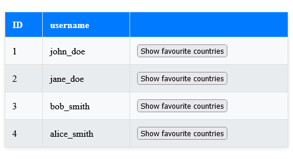
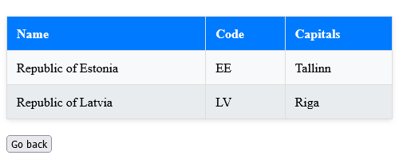

# Spring Boot Task

Implemented a **GET endpoint** `/{id}/favourite-countries` that fetches users favorite countries and fetches country data from an external API.

**Additionally** added exception handling when the `WebClientResponseException` is thrown (i.e. API is down), and retrieves country data from this database.

Added **liquibase changelog** and created a new user with their favourite countries 

---

# Angular Task

Implemented `UserListComponent` that displays a list of users, showing their **ID** and **username**. That fetches data from  **`GET /users` endpoint**. With the path set to **`''`**.

**Additionally** added button in the `UserListComponent`, that routes to`FavouriteCountriesComponent` and displays the users favourite countries(name, code and capitals) from the`/{id}/favourite-countries` endpoint in the Spring Boot backend.  

---

### UserListComponent

### FavouriteCountriesComponent

---

## How to run

### Prerequisites:

- **Java Version**: 21 (Ensure Java 21 is installed and configured)
- **Angular Version**: 16.2.5 (Ensure Angular CLI version 16.2.5 is installed)
- **Node Version**: Node.js should be installed to run Angular.
- **IDE**: IntelliJ IDEA (Recommended)

### Backend
- Run `UserCountriesApiApplication` in Intellij 

 or

1. Open terminal
2. Go to user-countries-api folder:
   - `cd user-countries-api`
3. Build the application:
   - `mvn clean install`
4. Run the springboot:
   - `mvn spring-boot:run`

### Frontend

1. Open terminal
2. Go to user-countries-ui/user-countries
   - `cd user-countries-ui/user-countries`
3. Run npm
   - `npm i`
4. Run frontend
   - `ng serve --open`
---
